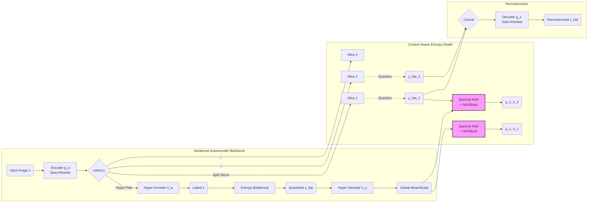

In your architecture, **$\mu$ (Mu)** and **$\sigma$ (Sigma)** play the critical role of **Entropy Modeling**. They are the parameters used to model the probability distribution of the latent representation $y$.

Here is the breakdown of their specific roles in the compression pipeline:

### 1. The Mathematical Role: Defining the Distribution
The core assumption in learned image compression is that the latent values $y$ (the compressed feature map) follow a **Gaussian Distribution**.
*   **$\mu$ (Mean):** This is the model's **prediction** of what the value of the latent pixel $y$ is going to be.
*   **$\sigma$ (Scale/Std Dev):** This represents the **uncertainty** or the width of the bell curve.
    *   **Small $\sigma$:** The model is very confident. The bell curve is narrow and tall.
    *   **Large $\sigma$:** The model is unsure. The bell curve is wide and flat.

### 2. The Functional Role: Bitrate Estimation & Coding
These values are fed into the **Arithmetic Coder** (or ANS - Asymmetric Numeral Systems).

*   **During Compression (Bitrate Reduction):**
    *   The arithmetic coder looks at the actual value of $y$.
    *   It checks the probability curve defined by $\mu$ and $\sigma$.
    *   If the actual $y$ is close to the predicted $\mu$ and the $\sigma$ is small (high confidence), the probability is very high. **High probability = Very few bits needed.**
    *   If the prediction is wrong (far from $\mu$) or confidence is low, more bits are used.
    *   **Therefore, better predictions of $\mu$ and $\sigma$ result in a smaller file size (lower BPP).**

### 3. The Sequential Role (Why $\mu_1, \sigma_1$ vs $\mu_2, \sigma_2$?)
Your model uses **Slicing** (Context-Awareness). This creates a chain of improving predictions:

*   **$\mu_1, \sigma_1$ (For Slice 1):**
    *   These are predicted **only** using the Hyper-prior ($z$).
    *   Since the context is limited, the $\sigma_1$ (uncertainty) might be slightly higher.
*   **$\mu_2, \sigma_2$ (For Slice 2):**
    *   These are predicted using the Hyper-prior **AND** the information from Slice 1 ($y\_hat\_1$).
    *   Because the model can "see" the first part of the image features (Slice 1), it can make a much more accurate guess for Slice 2.
    *   **Result:** $\mu_2$ is more accurate, and $\sigma_2$ is smaller. This allows Slice 2 to be compressed even more tightly than Slice 1.

### 4. The Reconstruction Role (Quantization)
In your code (`dcae.py`), you will see lines like this:
```python
y_hat_slice = ste_round(y_slice - mu) + mu
```
Here, $\mu$ plays a role in reducing **Quantization Error**.
Instead of rounding $y$ to the nearest integer (0, 1, 2...), we effectively round it relative to the predicted mean. This centers the quantization grid on the expected value, preserving more detail in the reconstructed image ($\hat{x}$).

### Summary
*   **$\mu$ (Mean):** The "Guess" of the latent value.
*   **$\sigma$ (Scale):** The "Confidence" of the guess.
*   **Together:** They tell the Entropy Engine (Arithmetic Coder) how to compress the data into the smallest possible binary string.