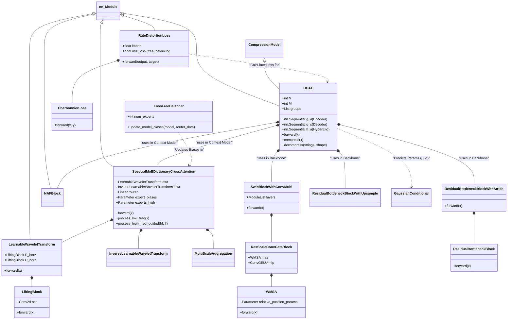

```mermaid
classDiagram
    %% --- Inheritance Relationships ---
    nn_Module <|-- DCAE
    nn_Module <|-- SpectralMoEDictionaryCrossAttention
    nn_Module <|-- NAFBlock
    nn_Module <|-- RateDistortionLoss
    nn_Module <|-- LearnableWaveletTransform
    CompressionModel <|-- DCAE

    %% --- Main Model Composition ---
    class DCAE {
        +int N
        +int M
        +List groups
        +nn.Sequential g_a (Encoder)
        +nn.Sequential g_s (Decoder)
        +nn.Sequential h_a (HyperEnc)
        +forward(x)
        +compress(x)
        +decompress(strings, shape)
    }

    %% DCAE contains these specific blocks
    DCAE *-- SpectralMoEDictionaryCrossAttention : "uses in Context Model"
    DCAE *-- NAFBlock : "uses in Context Model"
    DCAE *-- SwinBlockWithConvMulti : "uses in Backbone"
    DCAE *-- ResidualBottleneckBlockWithStride : "uses in Backbone"
    DCAE *-- ResidualBottleneckBlockWithUpsample : "uses in Backbone"
    DCAE ..> GaussianConditional : "Predicts Params (μ, σ)"

    %% --- Swin / Context Modules ---
    class SpectralMoEDictionaryCrossAttention {
        +LearnableWaveletTransform dwt
        +InverseLearnableWaveletTransform idwt
        +Linear router
        +Parameter expert_biases
        +Parameter experts_high
        +forward(x)
        +process_low_freq(x)
        +process_high_freq_guided(hf, lf)
    }

    class LearnableWaveletTransform {
        +LiftingBlock P_horz
        +LiftingBlock U_horz
        +forward(x)
    }

    class LiftingBlock {
        +Conv2d net
        +forward(x)
    }

    SpectralMoEDictionaryCrossAttention *-- LearnableWaveletTransform
    SpectralMoEDictionaryCrossAttention *-- InverseLearnableWaveletTransform
    SpectralMoEDictionaryCrossAttention *-- MultiScaleAggregation
    LearnableWaveletTransform *-- LiftingBlock

    %% --- Backbone Modules ---
    class SwinBlockWithConvMulti {
        +ModuleList layers
        +forward(x)
    }
    
    class ResScaleConvGateBlock {
        +WMSA msa
        +ConvGELU mlp
    }

    class WMSA {
        +Parameter relative_position_params
        +forward(x)
    }

    SwinBlockWithConvMulti *-- ResScaleConvGateBlock
    ResScaleConvGateBlock *-- WMSA

    %% --- ResNet Modules ---
    class ResidualBottleneckBlockWithStride {
        +forward(x)
    }
    class ResidualBottleneckBlock {
        +forward(x)
    }
    
    ResidualBottleneckBlockWithStride *-- ResidualBottleneckBlock

    %% --- Loss and Training ---
    class RateDistortionLoss {
        +float lmbda
        +bool use_loss_free_balancing
        +forward(output, target)
    }

    class LossFreeBalancer {
        +int num_experts
        +update_model_biases(model, router_data)
    }
    
    class CharbonnierLoss {
        +forward(x, y)
    }

    RateDistortionLoss *-- CharbonnierLoss
    RateDistortionLoss ..> DCAE : "Calculates loss for"
    LossFreeBalancer ..> SpectralMoEDictionaryCrossAttention : "Updates Biases in"
```