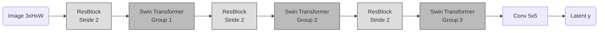

```mermaid
graph LR
    Img(Image 3xHxW) --> RB1[ResBlock <br/> Stride 2]
    RB1 --> SW1[Swin Transformer <br/> Group 1]
    
    SW1 --> RB2[ResBlock <br/> Stride 2]
    RB2 --> SW2[Swin Transformer <br/> Group 2]
    
    SW2 --> RB3[ResBlock <br/> Stride 2]
    RB3 --> SW3[Swin Transformer <br/> Group 3]
    
    SW3 --> Conv[Conv 5x5]
    Conv --> Latent(Latent y)

    style RB1 fill:#ddd,stroke:#333
    style RB2 fill:#ddd,stroke:#333
    style RB3 fill:#ddd,stroke:#333
    style SW1 fill:#bbb,stroke:#333
    style SW2 fill:#bbb,stroke:#333
    style SW3 fill:#bbb,stroke:#333
```