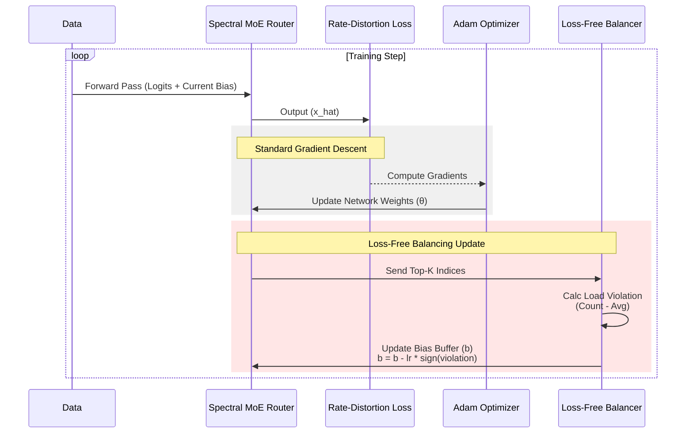

**Yes, absolutely.** They are the single most important variables for calculating the **Rate Loss** (BPP), and they also influence the **Distortion Loss**.

Here is exactly how they connect to the loss function in your code:

### 1. Direct Responsibility: The Rate Loss (BPP)
In your loss function (`new_loss.py`), you have this line:
```python
out["bpp_loss"] = (total_y_bpp + bpp_z) / ...
```
This `total_y_bpp` is calculated using **Likelihoods**, which come directly from $\mu$ and $\sigma$.

**The Logic:**
1.  The model assumes the data $y$ follows a Gaussian distribution defined by $\mathcal{N}(\mu, \sigma)$.
2.  The probability (likelihood) of a specific value $y$ is calculated as:
    $$P(y) \approx \text{Gaussian}(y \mid \mu, \sigma)$$
3.  The **Loss** is the negative log of this probability (information theory definition of bits):
    $$Loss_{rate} = -\log_2(P(y))$$

**How $\mu$ and $\sigma$ lower the loss:**
*   If **$\mu$ is accurate** (close to the real $y$), the probability $P(y)$ goes UP $\rightarrow$ Loss goes **DOWN**.
*   If **$\sigma$ is small** (confident) AND $\mu$ is correct, the probability $P(y)$ goes WAY UP $\rightarrow$ Loss goes **WAY DOWN**.

### 2. Indirect Responsibility: The Distortion Loss (MSE)
In `dcae.py`, $\mu$ is used during the quantization step:
```python
# Ste_round is "Straight Through Estimator" rounding
y_hat_slice = ste_round(y_slice - mu) + mu
```
This means $\mu$ acts as a "center" for rounding.
*   If $\mu$ is accurate, the quantization error $(y - \hat{y})$ is smaller.
*   Smaller quantization error means the reconstructed image $\hat{x}$ looks more like the original image $x$.
*   This reduces the **MSE Loss** or **MS-SSIM Loss**.

### Summary Equation
Your total training objective is:
$$L = \underbrace{-\log(P(y|\mu, \sigma))}_{\text{Rate Loss (controlled by } \mu, \sigma)} + \lambda \times \underbrace{\text{MSE}(x, \hat{x})}_{\text{Distortion Loss}}$$

So, **$\mu$ and $\sigma$ are the "knobs" the network turns to minimize the Rate Loss.**