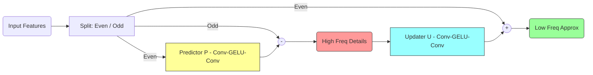

```mermaid
flowchart LR
    Input(Input Features) --> Split[Split: Even / Odd]
    Split -- Even --> P_Block[Predictor P - Conv-GELU-Conv]
    Split -- Odd --> Sub(( - ))
    
    P_Block --> Sub
    Sub --> HF(High Freq Details)
    
    HF --> U_Block[Updater U - Conv-GELU-Conv]
    Split -- Even --> Add(( + ))
    U_Block --> Add
    
    Add --> LF(Low Freq Approx)
    
    style P_Block fill:#ff9,stroke:#333
    style U_Block fill:#9ff,stroke:#333
    style HF fill:#f99,stroke:#333
    style LF fill:#9f9,stroke:#333
```