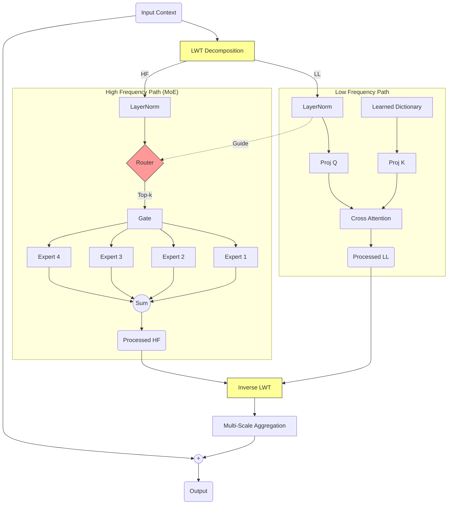

```mermaid
graph TD
    In(Input Context) --> LWT[LWT Decomposition]
    LWT -- LL --> Norm1[LayerNorm]
    LWT -- HF --> Norm2[LayerNorm]
    
    subgraph "Low Frequency Path"
    Norm1 --> Q1[Proj Q]
    Dict[Learned Dictionary] --> K1[Proj K]
    Q1 & K1 --> Attn1[Cross Attention]
    Attn1 --> OutLL(Processed LL)
    end
    
    subgraph "High Frequency Path (MoE)"
    Norm2 --> Router{Router}
    Norm1 -.->|Guide| Router
    Router -->|Top-k| Switch[Gate]
    
    Switch --> E1[Expert 1]
    Switch --> E2[Expert 2]
    Switch --> E3[Expert 3]
    Switch --> E4[Expert 4]
    
    E1 & E2 & E3 & E4 --> Sum((Sum))
    Sum --> OutHF(Processed HF)
    end
    
    OutLL & OutHF --> ILWT[Inverse LWT]
    ILWT --> MSA[Multi-Scale Aggregation]
    MSA --> Res(( + ))
    In --> Res
    Res --> Final(Output)

    style LWT fill:#ff9,stroke:#333
    style ILWT fill:#ff9,stroke:#333
    style Router fill:#f99,stroke:#333
```

