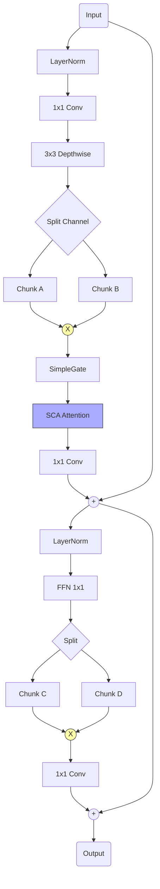

```mermaid
graph TD
    In(Input) --> LN1[LayerNorm]
    LN1 --> Conv1[1x1 Conv]
    Conv1 --> DW[3x3 Depthwise]
    
    DW --> Split{Split Channel}
    Split --> A[Chunk A]
    Split --> B[Chunk B]
    A & B --> Mul(( X ))
    Mul --> Label1[SimpleGate]
    
    Label1 --> SCA[SCA Attention]
    SCA --> Conv2[1x1 Conv]
    Conv2 --> Add1(( + ))
    In --> Add1
    
    Add1 --> LN2[LayerNorm]
    LN2 --> FFN[FFN 1x1]
    FFN --> Split2{Split}
    Split2 --> C[Chunk C]
    Split2 --> D[Chunk D]
    C & D --> Mul2(( X ))
    Mul2 --> Conv3[1x1 Conv]
    
    Conv3 --> Add2(( + ))
    Add1 --> Add2
    Add2 --> Out(Output)

    style Mul fill:#ffa,stroke:#333
    style Mul2 fill:#ffa,stroke:#333
    style SCA fill:#aaf,stroke:#333
```