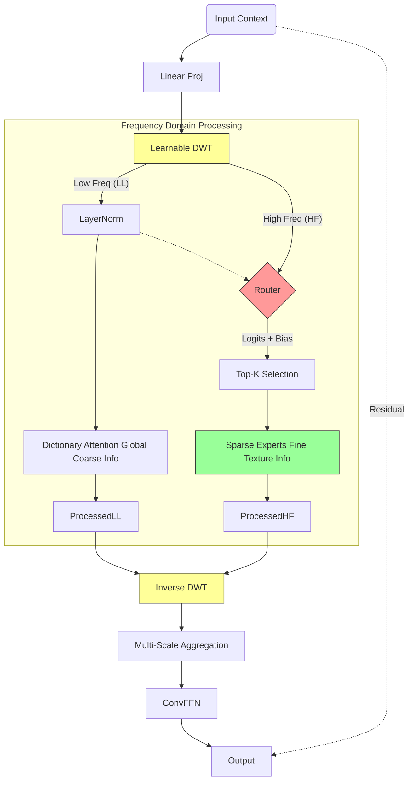
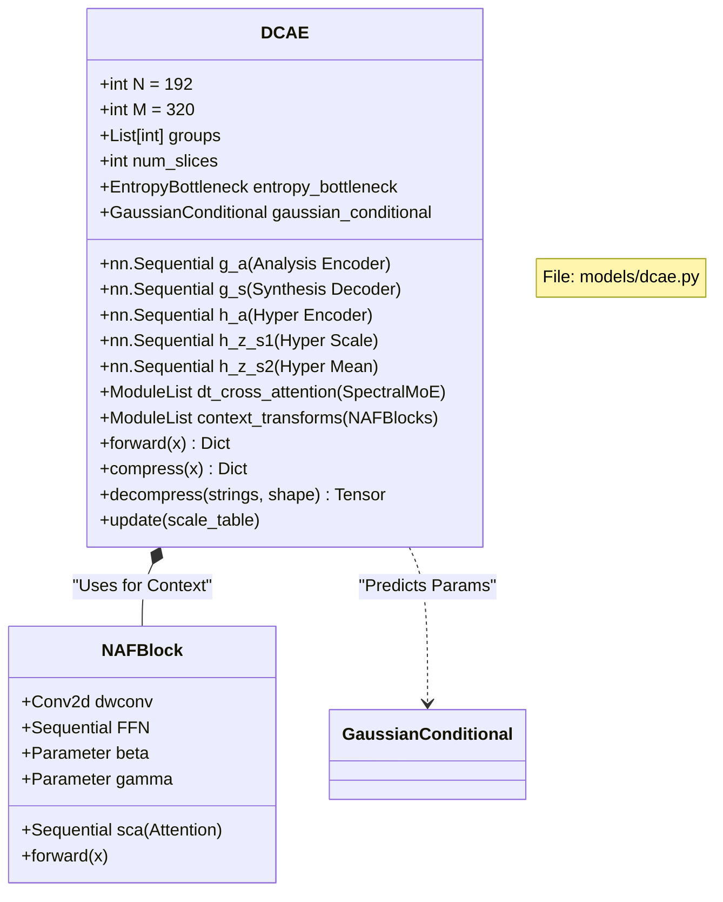
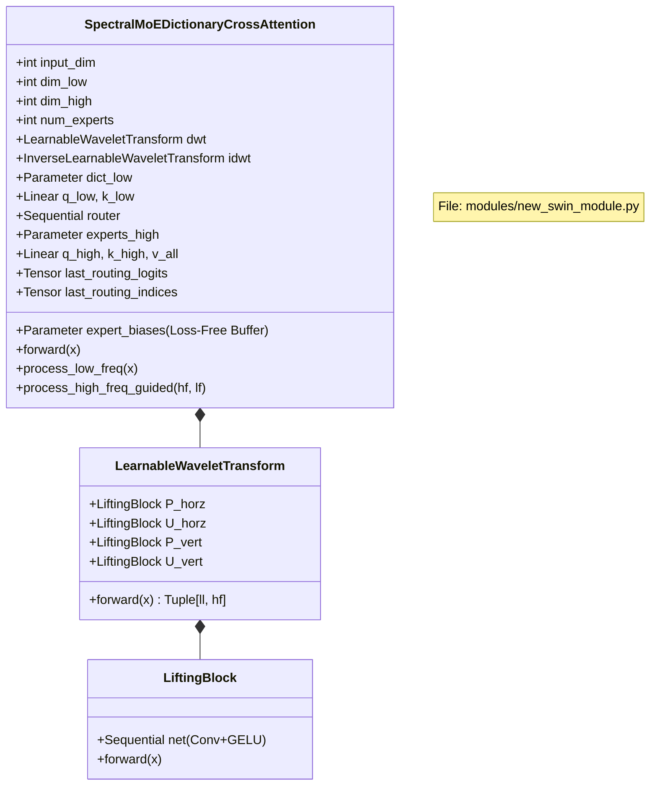
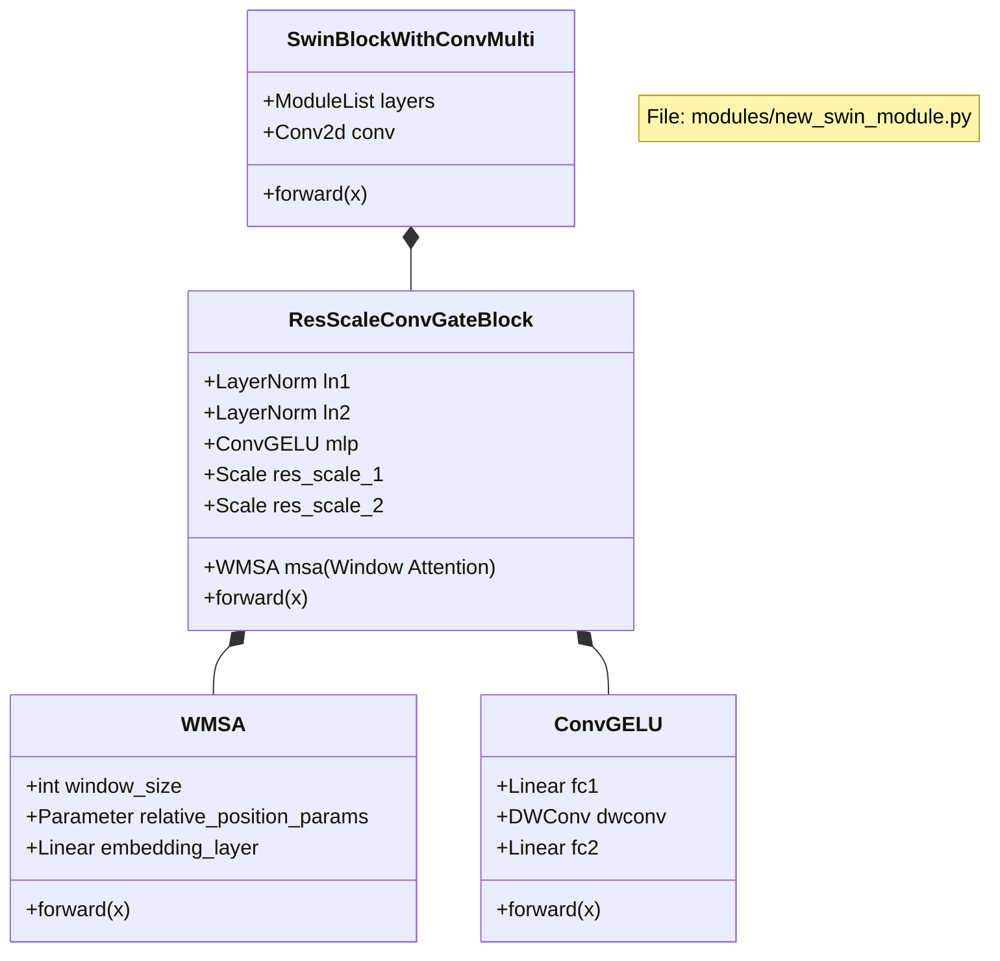
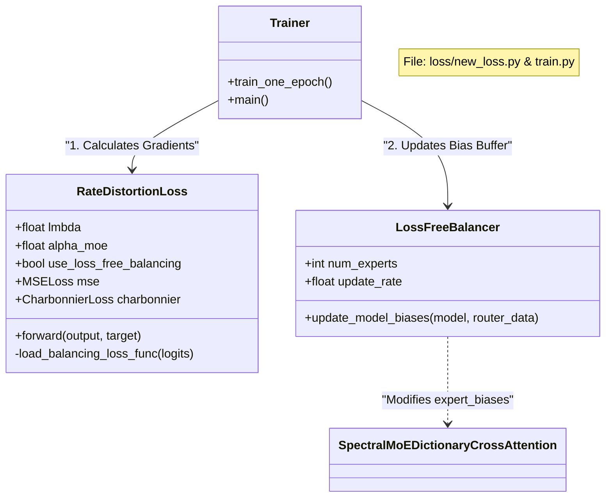

To provide the most detailed view for your paper, here are the **Class Diagrams broken down by specific module**. You can generate these using Mermaid.

These diagrams focus on **attributes (variables)** and **methods (functions)** to show exactly how data is stored and processed.

### 1. The Main DCAE Model (Architecture)
This diagram shows the high-level container that manages the compression pipeline, the entropy bottlenecks, and the slicing groups.

---

### 2. The Spectral MoE Module (The Core Innovation)
This is the most important diagram for your methodology section. It details the **Wavelet Transform** and the **Mixture of Experts** internals, including the routing cache.

---

### 3. The Backbone Blocks (Swin & ResNet)
This diagram explains the building blocks of your Encoder (`g_a`) and Decoder (`g_s`).

---

### 4. The Loss & Training System
This diagram illustrates how the **Loss Function** calculates gradients and how the **LossFreeBalancer** interacts with the model from the outside.

